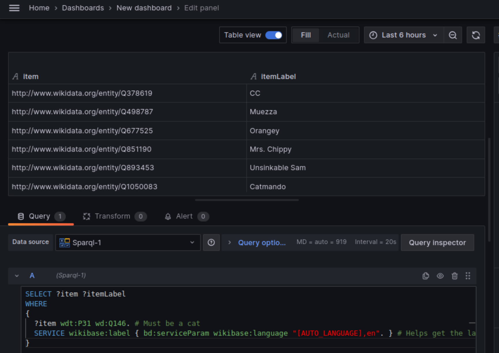

# SPARQL Data Source Plugin for Grafana

Welcome to the SPARQL Data Source Plugin for Grafana, an open-source plugin that allows you to query and visualize data from SPARQL endpoints directly within Grafana dashboards. This plugin is designed to integrate seamlessly with Grafana, providing a user-friendly interface to explore and visualize RDF data stored in SPARQL 1.1 compliant databases. 


## Features

- **Custom Query Support**: Write your own SPARQL queries to fetch data from your RDF database.
- **Variable Support**: Utilize Grafana's variable feature to create dynamic dashboards.
- **Visualization Compatibility**: Compatible with a wide range of Grafana visualization panels, including tables.
- **Secure Connections**: Support for HTTP and HTTPS SPARQL endpoints with basic auth or token-based authentication methods.

Version 10.3.3

Before you begin, ensure you have the following:


## Prerequisites
- Grafana (version 10.3.3 or higher)
- Mage Build Tool v1.15.0-5-g2385abb
- Golan version go1.21.4 or higher
- Access to a SPARQL 1.1 compliant endpoint(eg: https://dbpedia.org/sparql,https://lov.linkeddata.es/dataset/lov/sparql)

## Installation

### Frontend

1. Install dependencies

   ```bash
   npm install
   ```

2. Build plugin in development mode and run in watch mode

   ```bash
   npm run dev
   ```

3. Build plugin in production mode if needed, 

   ```bash
   npm run build
   ```

### Backend

1. Update [Grafana plugin SDK for Go](https://grafana.com/developers/plugin-tools/introduction/grafana-plugin-sdk-for-go) dependency to the latest minor version:

   ```bash
   go get -u github.com/grafana/grafana-plugin-sdk-go
   go mod tidy
   ```

2. Build backend plugin binaries for Linux, Windows and Darwin:

   ```bash
   mage -v build:linux
   ```
3. Build backend plugin for debug mode

   ```bash
   mage build:debug
   ```
 
4. To run the backend development mode 

   ```bash
   docker-compose up --build
   ```

### Access to plugin 

http://localhost:3000/connections/datasources/fau-sparql-datasource

### Configure Data
Configure SPARQL as DataSource


### Query Data

Query Neo4j DataSource with Cypher Query Language and display as Table



## Examples:
Here are a few example queries to get you started:
   ```sparql
   SELECT ?item ?itemLabel 
   WHERE 
   {
   ?item wdt:P31 wd:Q146. # Must be a cat
   SERVICE wikibase:label { bd:serviceParam wikibase:language "[AUTO_LANGUAGE],en". } # Helps get the label in your language, if not, then en language
   }
   ```
## Support
If you encounter any issues or have questions, please file an issue on our GitHub repository.

## Contributing
Contributions to the SPARQL Data Source Plugin are welcome! Please read our contributing guidelines to get started.

## License
This project is licensed under the MIT License.

